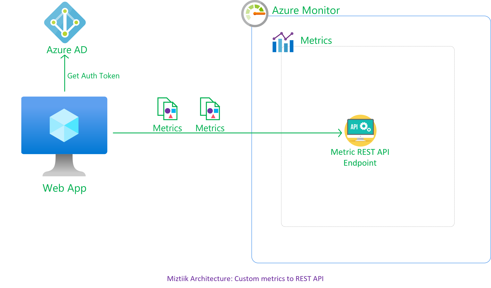

# Custom Metrics to Azure Monitor - REST API Endpoint

Developers at Mystique Unicorn are looking for a way to track the performance of their application using business metrics. Their application processess orders from stores from different location. They would like to know how many orders/events are in the queue at any given time. They are looking for a central way to store and visualize them. Can you show them how the can get started?

## 🎯 Solution

We can use Azure Monitor Custom metrics<sup>[1]</sup> for our solution. These can be performance metrics or business/app specific. We have multiple ways of doing so, the most common ways are

1. Bootstrapping the application with Azure Application Insights SDK to send custom telemetry
1. Using Azure Monitor Agent<sup>[3]</sup>
1. Send them directly using the Azure Monitor REST API

Azure Monitor Custom Metrics allows you to authenticate<sup>[4]</sup> against the endpoint using Azure AD Service Principal or Managed Identities. This blog<sup>[2]</sup>, shows how to emit custom metrics using Service Principal. This may not be needed when your resources are already running on Azure. For ex, A VM running in Azure can leverage managed identities. We can get the `access token` to authenticate against the Azure Monitor REST API using Managed Identity<sup>[5]</sup>. To get the access token the role should have `Monitoring Metrics Publisher`<sup>[9]</sup> role assigned to it and make a `OAuth` token request to the `https://monitor.azure.com/`. We will see how to do this in the demo section.

When we are planning to send custom metrics, it is important to understand the structure of the metric so that we can send the right data. The docs<sup>[6]</sup> has a good explanation of the structure. But there are few things we need to decide to send the correct data at the right frequency.

- Each metric data point published contains a `namespace`, `name`, and `dimension` information. 
    - Choose your `dimension` wisely. Avoid high cardinatlity(for ex _timestamp_) 
- Azure Monitor stores all metrics at `1`-minute granularity intervals. 
    - During a given minute, a metric might need to be sampled several times. - For example - CPU utilization. It is a good idea to pre-aggregate and emit the aggregated values. This can reduce ingestion costs.
    - Another metric might need to be measured for many discrete events, such as sign-in transaction latencies
    - An example the queue length will depending upon the time of the day, morning rush hour might have more events and needing to be sampled often. 
- Azure Monitor doesn't support defining `Units` for a custom metric<sup>[7]</sup>.
- Custom Mertics are stored for `93` days by default. Plan your data retention accordingly.<sup>[8]</sup>


Now that the basics are covered, lets see this in action.



1. ## 🧰 Prerequisites

   This demo, instructions, scripts and bicep template is designed to be run in `westeurope`. With few or no modifications you can try it out in other regions as well(_Not covered here_).

   - 🛠 Azure CLI Installed & Configured - [Get help here](https://learn.microsoft.com/en-us/cli/azure/install-azure-cli)
   - 🛠 Bicep Installed & Configured - [Get help here](https://learn.microsoft.com/en-us/azure/azure-resource-manager/bicep/install)
   - 🛠 VS Code & Bicep Extenstions - [Get help here](https://learn.microsoft.com/en-us/azure/azure-resource-manager/bicep/install#vs-code-and-bicep-extension)

1. ## ⚙️ Setting up the environment

   - Get the application code

     ```bash
     https://github.com/miztiik/azure-send-custom-metrics-using-umi
     cd azure-send-custom-metrics-using-umi
     ```

1. ## 🚀 Prepare the environment

   Let check you have Azure Cli working with 

    ```bash
      # You should have azure cli preinstalled
      az account show
    ```

    You should see an output like this,

   ```json
    {
      "environmentName": "AzureCloud",
      "homeTenantId": "16b30820b6d3",
      "id": "1ac6fdbff37cd9e3",
      "isDefault": true,
      "managedByTenants": [],
      "name": "YOUR-SUBS-NAME",
      "state": "Enabled",
      "tenantId": "16b30820b6d3",
      "user": {
        "name": "miztiik@",
        "type": "user"
      }
    }
   ```

1. ## 🚀 Deploying the application

   - **Stack: Main Bicep**
     The params required for the modules are in `params.json`. Do modify them to suit your need.(_Especially the `adminPassword.secureString` for the VM. You are strongly encouraged to Just-In-Time access<sup>[10]</sup> or use SSH key instead of password based authentication_). The helper deployment script `deploy.sh` will deploy the `main.bicep` file. This will create the following resoureces
     - Resource Group(RG)
     - VNet, Subnet & Virtual Machine
     - Virtual Machine(Ubuntu)
        - Bootstrapped with custom libs using `userData` script.
     - User Managed Identity
        - Monitoring Metrics Publisher role assigned to the identity
        - Identity attached to the VM

        
     **Note** - I hacked the template from another repo of mine, so you will see some unused resources. _You can safely ignore them, But do remember to clean up your Resource Group to avoid unnecessary costs._

      ```bash
      sh deploy.sh
      ```

     After successfully deploying the stack, Check the `Resource Groups/Deployments` section for the resources.

      - **IMPORTANT** - Do not forget to update the `time` parameter in the json. This should 30minutes behind UTC or 4minutes in the future. But always from **UTC** time.


1. ## 🔬 Testing the solution

   - **Connect to the VM**

      The Ubuntu vm _should_ be bootstrapped using `userData` to install python3, git and also Azure Idenity initialized.
      - Connect to the using using Just In Time Access<sup>[10]</sup>.
      - The following bash script does the following,
        - Get the VM Resource ID
        - Get the Access Token
        - Build the Metric Payload JSON
        - Send a metric every `10` seconds for `1000`(defined by variable `METRIC_COUNT`) times
      
        ```bash
        #!/bin/bash
        # set -x

        COMPUTER_NAME=$(hostname)
        LOG_FILE="/var/log/miztiik-${COMPUTER_NAME}-$(date +'%Y-%m-%d').json"
        
        SLEEP_AT_WORK_SECS=0
        METRIC_COUNT=100000
        RES_LOCATION="westeurope"
        VM_RES_ID=$(curl -H Metadata:true -s --noproxy "*" "http://169.254.169.254/metadata/instance/compute/resourceId?api-version=2021-05-01&format=text")

        # Either remove the leading slash in the Resource ID or add a slash in the endpoint URL
        # https://github.com/MicrosoftDocs/azure-docs/issues/107712
        METRIC_ENDPOINT="https://${RES_LOCATION}.monitoring.azure.com${VM_RES_ID}/metrics"
        # echo $METRIC_ENDPOINT

        RESPONSE=$(curl 'http://169.254.169.254/metadata/identity/oauth2/token?api-version=2018-02-01&resource=https://monitor.azure.com/' -H Metadata:true -s)
        ACCESS_TOKEN=$(echo $RESPONSE | python3 -c 'import sys, json; print (json.load(sys.stdin)["access_token"])')

        # echo $ACCESS_TOKEN

        for ((i=1; i<=METRIC_COUNT; i++)); do

            # Set variable values
            CURR_TIME=$(date +"%Y-%m-%dT%H:%M:%S")
            TIME_TWO_HRS_AGO=$(date -d "-2 hours" +"%Y-%m-%dT%H:%M:%S") 
            METRIC="PendingStoreEvents"
            NAMESPACE="SunMunStore"
            QUEUE_NAME="SaleEvents"
            MESSAGE_TYPE="InventoryEvents"
            MIN=$(shuf -i 1-30 -n 1)
            MAX=$MIN
            SUM=$MIN
            # MAX=$(shuf -i 11-20 -n 1)
            # SUM=$(shuf -i 21-30 -n 1)
            # COUNT=$(shuf -i 1-5 -n 1)
            COUNT=1

            # Build JSON string
            JSON_DATA="{\"time\":\"$CURR_TIME\",\"data\":{\"baseData\":{\"metric\":\"$METRIC\",\"namespace\":\"$NAMESPACE\",\"dimNames\":[\"QueueName\",\"MessageType\"],\"series\":[{\"dimValues\":[\"$QUEUE_NAME\",\"$MESSAGE_TYPE\"],\"min\":$MIN,\"max\":$MAX,\"sum\":$SUM,\"count\":$COUNT}]}}}"

            # echo "$JSON_DATA"

            curl --write-out %{http_code} -s\
            -X POST ${METRIC_ENDPOINT} \
            -H 'Content-Type: application/json' \
            -H "Authorization: Bearer $ACCESS_TOKEN" \
            -d "$JSON_DATA"

            echo -e "\n Sent Metric: ($i/$METRIC_COUNT) -------------\n"

            sleep $SLEEP_AT_WORK_SECS
        done
        ```

        Upon successful execution, You should receive `200` response code from the endpoint. If you navigate to the portal, You should see the metrics in the dashboard..

      
  
     
1. ## 📒 Conclusion

    Here we have demonstrated how to push custom metrics to the REST API using User Managed Identity.
  

1. ## 🧹 CleanUp

If you want to destroy all the resources created by the stack, Execute the below command to delete the stack, or _you can delete the stack from console as well_

- Resources created during [Deploying The Application](#-deploying-the-application)
- _Any other custom resources, you have created for this demo_

```bash
# Delete from resource group
az group delete --name Miztiik_Enterprises_xxx --yes
# Follow any on-screen prompt
```

This is not an exhaustive list, please carry out other necessary steps as maybe applicable to your needs.

## 📌 Who is using this

This repository aims to show how to Bicep to new developers, Solution Architects & Ops Engineers in Azure.

### 💡 Help/Suggestions or 🐛 Bugs

Thank you for your interest in contributing to our project. Whether it is a bug report, new feature, correction, or additional documentation or solutions, we greatly value feedback and contributions from our community. [Start here](/issues)

### 👋 Buy me a coffee

[](https://ko-fi.com/Q5Q41QDGK) Buy me a [coffee ☕][900].

### 📚 References


1. [Azure Docs: Azure Custom Metrics][1]
1. [Miztiik Blog: Custom Metrics to Azure Monitor - REST API Endpoint][2]
1. [Miztiik Blog: Send custom metrics from Vm to Azure Monitor using AMA][3]
1. [Azure Docs: Register App to get Auth Tokens from AAD][3]
1. [Azure Docs: Custom Metrics AuthN - Managed Identity & Service Principal][4]
1. [Azure Docs: Get Access Token From VM using Managed Identity][5]
1. [Azure Docs: Sample Custom Metric][6]
1. [Azure Docs: Custom Metric Definition][7]
1. [Azure Docs: Platform and custom metrics Retention][8]
1. [Azure Docs: BuiltIn Roles - Monitoring Metrics Publisher][8]
1. [Azure Docs: Just In Time Access][10]

### 🏷️ Metadata


**Level**: 100

[1]: https://learn.microsoft.com/en-us/azure/azure-monitor/essentials/metrics-custom-overview
[2]: https://github.com/miztiik/azure-send-custom-metrics-using-umi
[3]: https://github.com/miztiik/send-vm-logs-to-azure-monitor
[4]: https://learn.microsoft.com/en-us/azure/azure-monitor/essentials/metrics-custom-overview#authentication
[5]: https://learn.microsoft.com/en-us/azure/active-directory/managed-identities-azure-resources/how-to-use-vm-token#get-a-token-using-curl
[6]: https://learn.microsoft.com/en-us/azure/azure-monitor/essentials/metrics-custom-overview#sample-custom-metric-publication
[7]: https://learn.microsoft.com/en-us/azure/azure-monitor/essentials/metrics-custom-overview#how-to-send-custom-metrics
[8]: https://learn.microsoft.com/en-us/azure/azure-monitor/essentials/data-platform-metrics#platform-and-custom-metrics
[9]: https://learn.microsoft.com/en-us/azure/role-based-access-control/built-in-roles#monitoring-metrics-publisher


[10]: https://learn.microsoft.com/en-us/azure/defender-for-cloud/just-in-time-access-usage

[100]: https://www.udemy.com/course/aws-cloud-security/?referralCode=B7F1B6C78B45ADAF77A9
[101]: https://www.udemy.com/course/aws-cloud-security-proactive-way/?referralCode=71DC542AD4481309A441
[102]: https://www.udemy.com/course/aws-cloud-development-kit-from-beginner-to-professional/?referralCode=E15D7FB64E417C547579
[103]: https://www.udemy.com/course/aws-cloudformation-basics?referralCode=93AD3B1530BC871093D6
[899]: https://www.udemy.com/user/n-kumar/
[900]: https://ko-fi.com/miztiik
[901]: https://ko-fi.com/Q5Q41QDGK