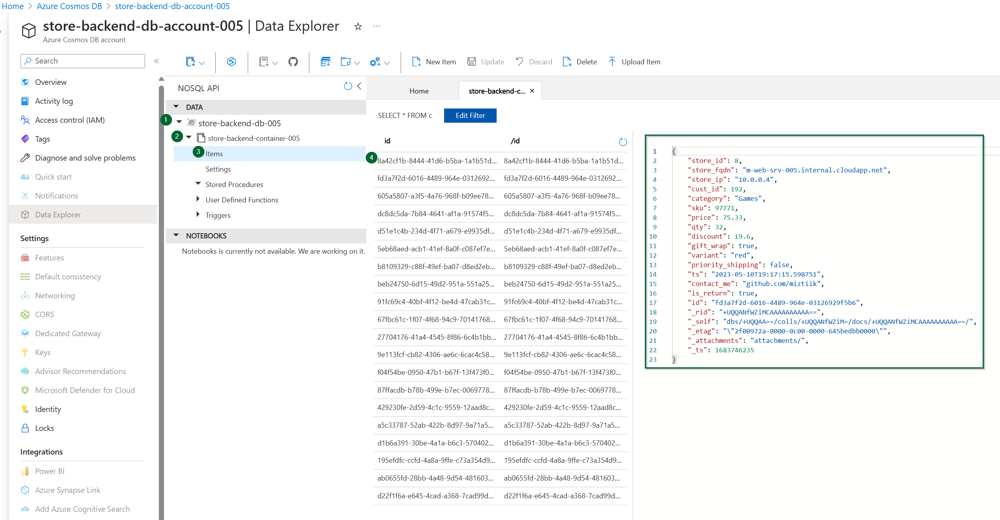

# Persist Data to Cosmos DB from Azure VM Using User Managed Identity

Developers at Mystique Unicorn are using priveleged identity to persist data to Cosmos DB. They would like to use User Managed Identity to persist data to Cosmos DB. Can you help them?


## 🎯 Solution

Azure offers user managed identity to be used with azure and non azure(aka on prem) resources. In this article, we will explore how to use user managed identity to persist data to Cosmos DB from Azure VM.


1. ## 🧰 Prerequisites

   This demo, instructions, scripts and bicep template is designed to be run in `westeurope`. With few or no modifications you can try it out in other regions as well(_Not covered here_).

   - 🛠 Azure CLI Installed & Configured - [Get help here](https://learn.microsoft.com/en-us/cli/azure/install-azure-cli)
   - 🛠 Bicep Installed & Configured - [Get help here](https://learn.microsoft.com/en-us/azure/azure-resource-manager/bicep/install)
   - 🛠 VS Code & Bicep Extenstions - [Get help here](https://learn.microsoft.com/en-us/azure/azure-resource-manager/bicep/install#vs-code-and-bicep-extension)

1. ## ⚙️ Setting up the environment

   - Get the application code

     ```bash
     https://github.com/miztiik/azure-vm-to-cosmos-db
     cd azure-vm-to-cosmos-db
     ```

1. ## 🚀 Prepare the environment

   Let check you have Azure Cli working with 

    ```bash
      # You should have azure cli preinstalled
      az account show
    ```

    You should see an output like this,

   ```json
    {
      "environmentName": "AzureCloud",
      "homeTenantId": "16b30820b6d3",
      "id": "1ac6fdbff37cd9e3",
      "isDefault": true,
      "managedByTenants": [],
      "name": "YOUR-SUBS-NAME",
      "state": "Enabled",
      "tenantId": "16b30820b6d3",
      "user": {
        "name": "miztiik@",
        "type": "user"
      }
    }
   ```

1. ## 🚀 Deploying the application

   - **Stack: Main Bicep**
     The params required for the modules are in `params.json`. Do modify them to suit your need.(_Especially the `adminPassword.secureString` for the VM. You are strongly encouraged to [Just-In-Time access][10] or use SSH key instead of password based authentication_). The helper deployment script `deploy.sh` will deploy the `main.bicep` file. This will create the following resoureces
     - Resource Group(RG)
     - VNet, Subnet & Virtual Machine
     - Virtual Machine(Ubuntu)
        - Bootstrapped with custom libs using `userData` script.
      - Appl Configuration
        - `COSMOS_DB_ACCOUN_NAME` - Name of the cosmos DB Account
        - `COSMOS_DB_NAME` - Name of the cosmos DB
        - `COSMOS_DB_CONTAINER_NAME` - Name of the cosmos DB Containe
     - User Managed Identity
        - Monitoring Metrics Publisher role assigned to the 
        - Permission to read and write data to Cosmos DB
        - Identity attached to the VM
       
     **Note** - I hacked the template from another repo of mine, so you will see some unused resources(log analytics workspace/queues etc.,). _You can safely ignore them, But do remember to clean up your Resource Group to avoid unnecessary costs._

      ```bash
      sh deploy.sh
      ```

     After successfully deploying the stack, Check the `Resource Groups/Deployments` section for the resources.


1. ## 🔬 Testing the solution

   - **Connect to the VM**

      The Ubuntu vm _should_ be bootstrapped using `userData` to install python3, git and also Azure Idenity initialized.
      - Connect to the using using [Just-In-Time access][10].
         - The bootstrap code should have clone this repo to `/var/azure-vm-to-cosmos-db`, If not clone the repo.
      - The `az_producer_for_cosmos_db.py` script expects the following environment variable. _In production, you probabaly want to store these in App configuration_
         - `APP_CONFIG_NAME`

    - **Initiate Event Generation & Ingestion**

      ```bash
      # ssh miztiik@publicIP
      # cd /var/
      # git clone https://github.com/miztiik/azure-vm-to-cosmos-db
      # cd azure-vm-to-cosmos-db
     
      export APP_CONFIG_NAME="APP_CONFIG_VAR_NAME" 
      python3 /var/azure-vm-to-cosmos-db/app/az_producer_for_cosmos_db.py &
      ```

        If everything goes all right, you should see messages like below. You can also check the logs at `/var/log/miztiik-store-events-2023-04-17.json`

        ```bash
         INFO:root:Blob sales_events/event_type=sale_event/dt=2023_05_10/1683746549000636.json uploaded successfully
         INFO:root:Document with id ab0655fd-28bb-4a48-9d54-481603a1aa11 written to CosmosDB successfully
         INFO:root:{
            "request_id": "d22f1f6a-e645-4cad-a368-7cad99d9c02f",
            "store_id": 6,
            "store_fqdn": "m-web-srv-005.internal.cloudapp.net",
            "store_ip": "10.0.0.4",
            "cust_id": 918,
            "category": "Camera",
            "sku": 39156,
            "price": 53.78,
            "qty": 23,
            "discount": 7.6,
            "gift_wrap": true,
            "variant": "black",
            "priority_shipping": true,
            "ts": "2023-05-10T19:22:34.028842",
            "contact_me": "github.com/miztiik"
         }
         INFO:root:Blob sales_events/event_type=inventory_event/dt=2023_05_10/1683746554029194.json uploaded successfully
         INFO:root:Document with id d22f1f6a-e645-4cad-a368-7cad99d9c02f written to CosmosDB successfully
         INFO:root: {"resp":{"status": true, "tot_msgs": 10, "bad_msgs": 2, "sale_evnts": 7, "inventory_evnts": 3, "tot_sales": 510.67999999999995}} 
        ```

        Upon successful execution, You should receive `200` response code from the endpoint. If you navigate to the portal, You should see the metrics in the dashboard..

      

  
     
1. ## 📒 Conclusion

    Here we have demonstrated persist data to cosmos db using custom idenetity.
  

1. ## 🧹 CleanUp

If you want to destroy all the resources created by the stack, Execute the below command to delete the stack, or _you can delete the stack from console as well_

- Resources created during [Deploying The Application](#-deploying-the-application)
- _Any other custom resources, you have created for this demo_

```bash
# Delete from resource group
az group delete --name Miztiik_Enterprises_xxx --yes
# Follow any on-screen prompt
```

This is not an exhaustive list, please carry out other necessary steps as maybe applicable to your needs.

## 📌 Who is using this

This repository aims to show how to Bicep to new developers, Solution Architects & Ops Engineers in Azure.

### 💡 Help/Suggestions or 🐛 Bugs

Thank you for your interest in contributing to our project. Whether it is a bug report, new feature, correction, or additional documentation or solutions, we greatly value feedback and contributions from our community. [Start here](/issues)

### 👋 Buy me a coffee

[](https://ko-fi.com/Q5Q41QDGK) Buy me a [coffee ☕][900].

### 📚 References


1. [Azure Docs: Just In Time Access][10]

### 🏷️ Metadata


**Level**: 100

[10]: https://learn.microsoft.com/en-us/azure/defender-for-cloud/just-in-time-access-usage

[100]: https://www.udemy.com/course/aws-cloud-security/?referralCode=B7F1B6C78B45ADAF77A9
[101]: https://www.udemy.com/course/aws-cloud-security-proactive-way/?referralCode=71DC542AD4481309A441
[102]: https://www.udemy.com/course/aws-cloud-development-kit-from-beginner-to-professional/?referralCode=E15D7FB64E417C547579
[103]: https://www.udemy.com/course/aws-cloudformation-basics?referralCode=93AD3B1530BC871093D6
[899]: https://www.udemy.com/user/n-kumar/
[900]: https://ko-fi.com/miztiik
[901]: https://ko-fi.com/Q5Q41QDGK